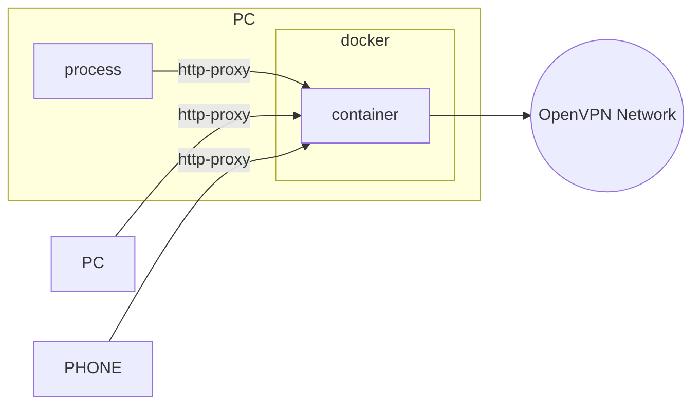

    

## 🗺 Overview

The Computer can be a Mac mini, Intel nuc, router, or any x86/arm64 device




## ✨ Features

- One port supports http and socks proxy protocol, by [clash](https://github.com/Dreamacro/clash)
- Advanced routing configuration, by [clash](https://github.com/Dreamacro/clash)
- Supports both x86 and arm64 architectures, by docker buildx
- The docker stop signal is received correctly

## 🧙‍♂️ Quickstart

```sh
docker run --device=/dev/net/tun \
    --cap-add=NET_ADMIN \
    -v "path/to/config.ovpn:/app/ovpn.d/config.ovpn" \
    -p 7890:7890 \
    -d ghcr.io/hurui/docker-openvpn-proxy
```

If the openvpn service needs to set up an internal dns server, you need to add the `--dns=ip` parameter of docker run. 

> Suppose the ip of the dns service is `10.0.0.1`, It is best to set up another public dns.

```sh
docker run --dns=10.0.0.1 --dns=1.1.1.1 ...
```

Override clash config file. More [documents](https://github.com/Dreamacro/clash/wiki/configuration)

`docker run -v "path/to/config.yaml:/app/clash.d/config.yaml" ...`

## Credits

- [Dreamacro/clash](https://github.com/Dreamacro/clash)
- [andyn922/docker-openvpn-proxy](https://github.com/andyn922/docker-openvpn-proxy)
- [wfg/docker-openvpn-client](https://github.com/wfg/docker-openvpn-client)
